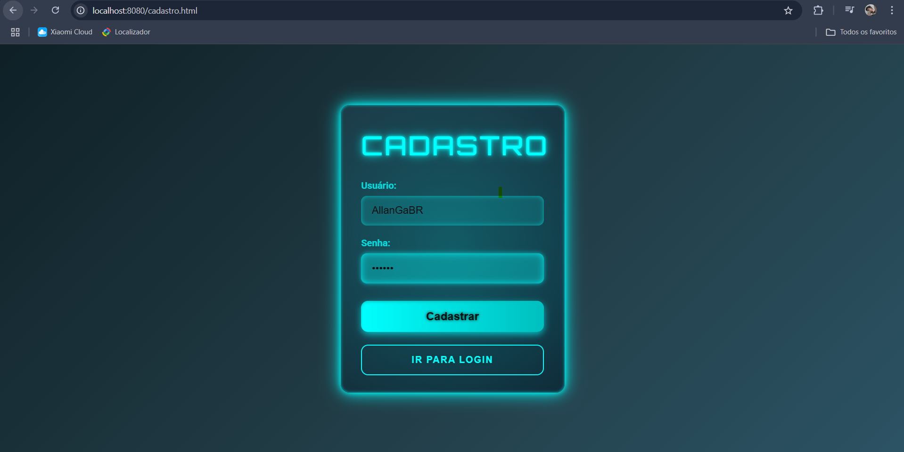
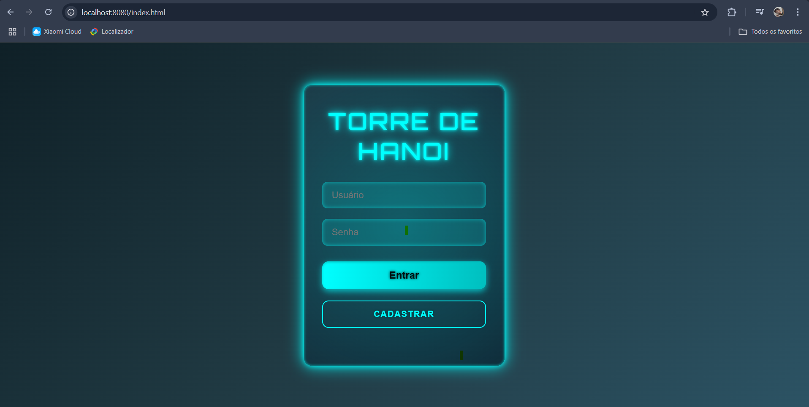
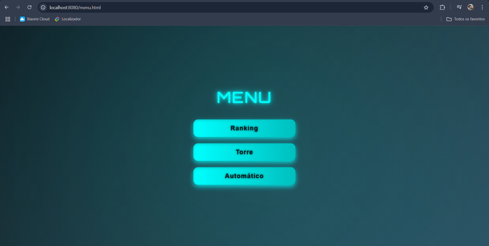
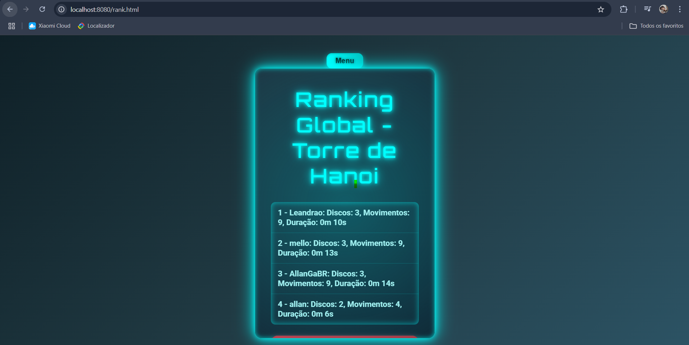

# 🏰 Torre de Hanói - Spring Boot

Aplicação web interativa da clássica **Torre de Hanói**, desenvolvida com **Spring Boot** no backend e **HTML, CSS e JavaScript** no frontend (pasta `static`).  
O sistema conta com **modo automático**, **modo manual** e um **ranking global** de jogadores.  

---

## 🎯 Objetivo

Proporcionar uma experiência prática e visual da Torre de Hanói, permitindo ao usuário jogar manualmente ou assistir à solução automática, além de competir em um ranking global.

---

## 🚀 Tecnologias utilizadas

- **Java 17+**
- **Spring Boot**  
  - Spring Web  
  - Spring Data JPA  
- **PostgreSQL**
- **HTML, CSS e JavaScript** (na pasta `src/main/resources/static`)

---

## 🏗️ Funcionalidades

- 🎮 **Modo Manual** → o usuário joga arrastando os discos.  
- 🤖 **Modo Automático** → o algoritmo resolve sozinho até **64 discos**.  
- 🏆 **Ranking Global** → registra pontuações e mostra os melhores jogadores.  
- 📊 **Banco de Dados** → partidas e rankings persistidos no **PostgreSQL**.  

---

## 📸 Telas da Aplicação Web

### Tela de Cadastro

### Tela de Login

### Menu Inicial

### Modo Automático

### Modo Manual

### Ranking Global

